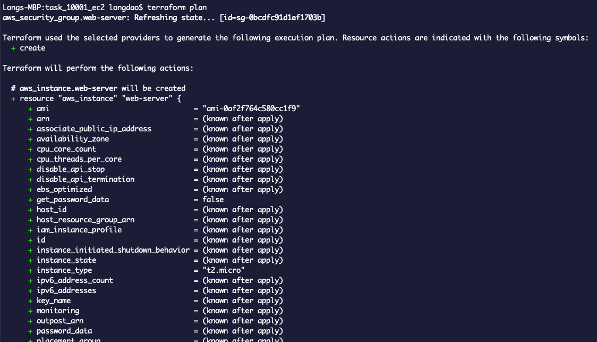
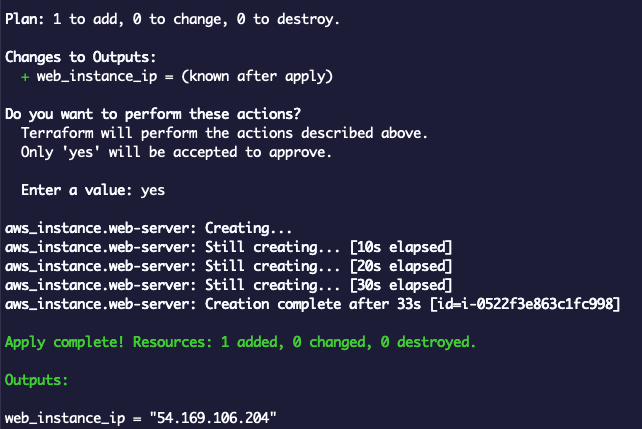

# Terraform - Launch an EC2 Instance

## Overview
Source code để dựng EC2 từ code terraform
Mô tả:
- Dựng 1 EC2 có cài đặt httpd để serve file html
- Sau khi run `terraform apply` thành công, recheck bằng cách truy cập ip generate bởi terraform, nếu hiện `Welcome to First EC2 build with Terraform. Happy Learning...` là thành công 
- Giải phóng resource `terraform destroy`. Check lại Instance đã terminated chưa.

## Download Terraform
Link: https://www.terraform.io/downloads.html

## Terraform Lifecycle
Terraform lifecycle consists of – **init, plan, apply, and destroy**.

- Terraform init initializes the working directory which consists of all the configuration files
- Terraform plan is used to create an execution plan to reach a desired state of the infrastructure. Changes in the configuration files are done in order to achieve the desired state.
- Terraform apply then makes the changes in the infrastructure as defined in the plan, and the infrastructure comes to the desired state.
- Terraform destroy is used to delete all the old infrastructure resources, which are marked tainted after the apply phase.

### Terraform Command
```
$ terraform version			# Check version, thường để check cài thành công chưa

$ terraform init    			# để init từ file main.tf
$ terraform plan    			# để xem code nó sẽ làm những gì
$ terraform apply    			# để thực thi code
$ terraform destroy				# để giải phóng resource
```

## Folder Structure
```
.  
├── variables.tf 		// Chứa danh sách variable sử dụng trong project
├── terraform.tfvars	// Chứa giá trị region, access_key, secret_key
├── main.tf				// Khai báo resource cần dựng ở AWS, terraform đọc file này để thực thi
└── output.tf 			// Các output cần terraform print ra màn hình sau khi apply
```

## Running this project
```
$ git clone ...
$ cd aws-launch-ec2-with-terraform
$ cp terraform.tfvars.example terraform.tfvars // Điền your region, access_key, secret_key vào terraform.tfvars
$ terraform init
$ terraform plan		// Chờ tầm 30s để terraform đọc code
$ terraform apply		// Chờ 1 lát để terraform triển khai hạ tầng lên AWS, xong thì sẽ print ra output theo define ở output.tf Nên mở AWS console check lại

$ terraform destroy		// Check lại AWS xem giải phóng resource chưa
```

**Terraform Plan**



**Terraform Apply**

